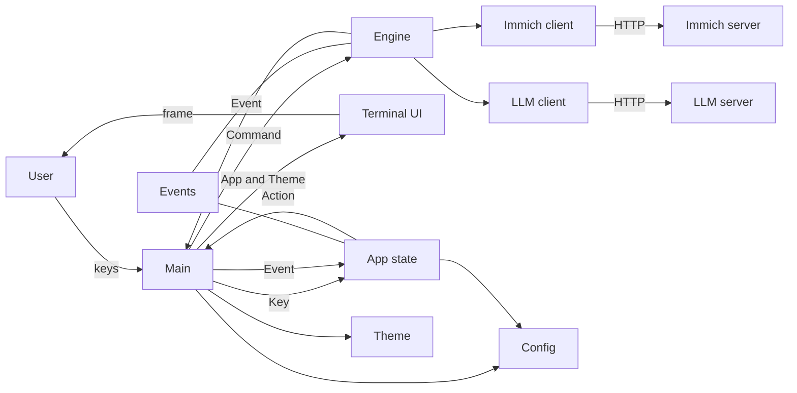
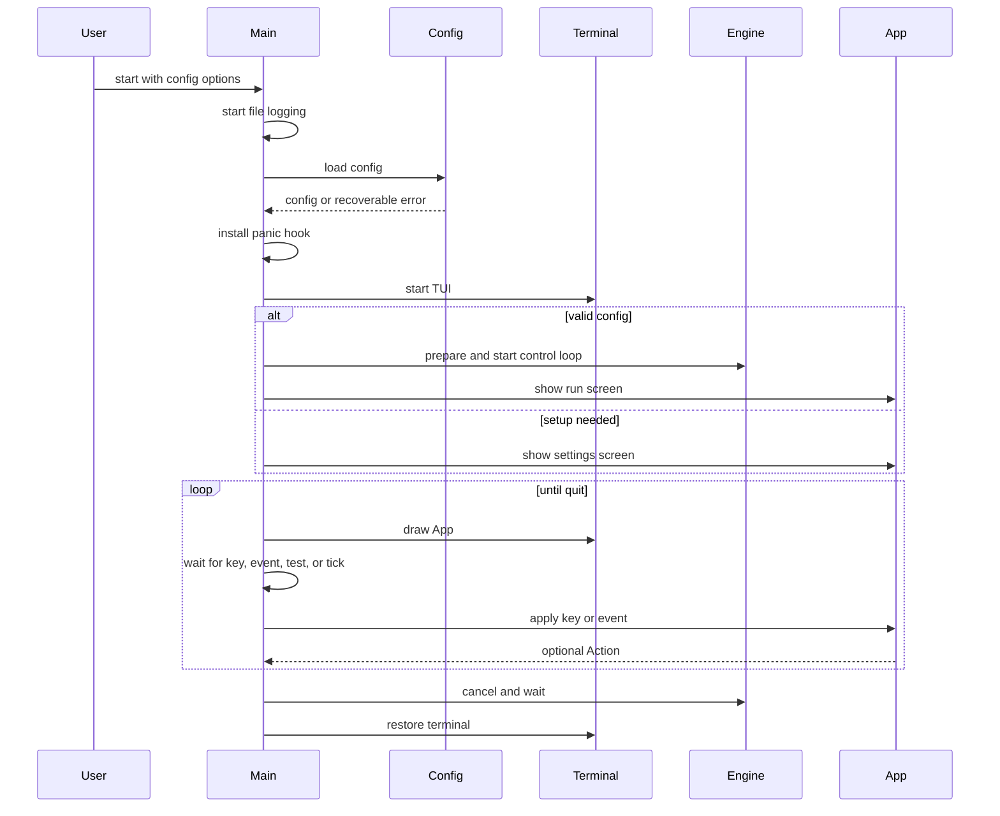
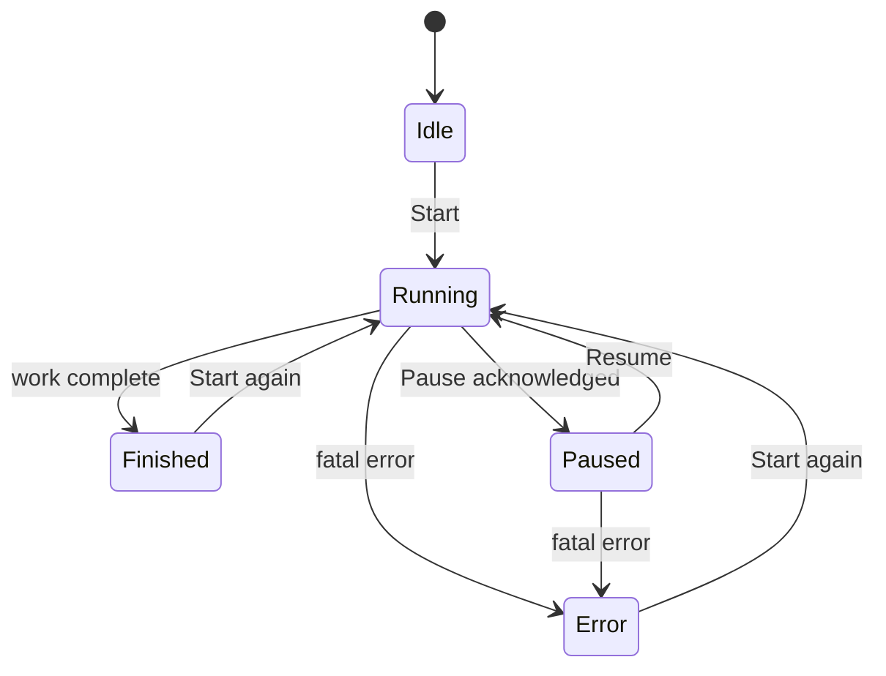
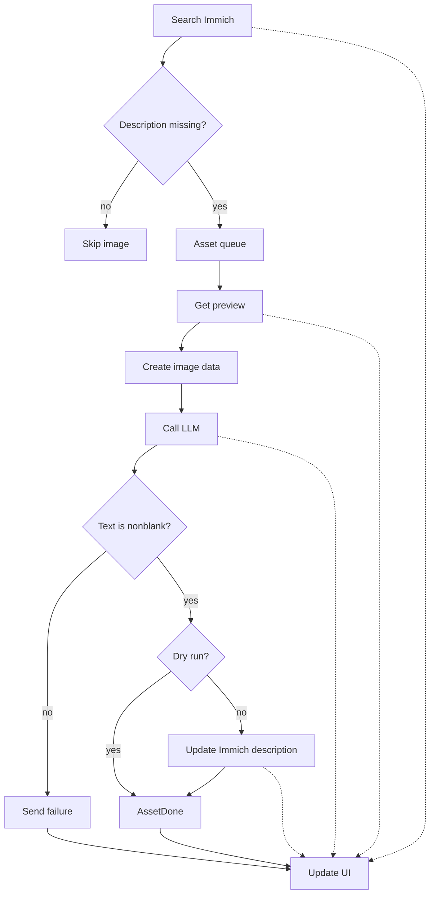

# Architecture

This document describes the code on the current `main` branch. It explains the main modules, the run lifecycle, concurrency, errors, configuration, the TUI, and the tests. It describes the current system. It is not a future design.

The text follows ASD-STE100 principles. It uses short sentences and common words where the technical meaning allows it.

## Overview

`immich-alt-text` is a Rust terminal application. It finds Immich images with no description. It downloads a preview image. It asks an OpenAI-compatible vision model for a description.

In normal mode, the application writes the description to Immich. In dry-run mode, it does not write to Immich. Both modes perform the search, preview download, and model request.

Immich stores the progress. A later normal run searches again. It skips images that already have descriptions. The application has no database, queue service, daemon, or background process.

### Main modules

- [`main`](src/main.rs) reads CLI options, loads the config, starts the terminal, runs the event loop, tests connections, replaces the runtime, and shuts down the application.
- [`App`](src/app.rs) stores UI state in memory. `App::on_key` converts input into an [`Action`](src/events.rs). `App::on_event` applies engine and connection-test events. `App` does not perform file, terminal, network, or async I/O.
- [`engine`](src/engine.rs) finds and processes assets. It controls workers, retries, pause, cancellation, and run events.
- [`ui`](src/ui/mod.rs) reads `App` and `Theme` and draws the Ratatui frame. The renderers do not change application state, except for the prompt width value used by the settings form.
- [`immich`](src/immich.rs) and [`llm`](src/llm.rs) contain the HTTP clients. [`config`](src/config.rs) contains config load, save, and validation. [`settings`](src/settings.rs) contains editable form state. [`theme`](src/theme.rs) contains display styles.

### Design goals

- **Safe repeat runs.** Only images without descriptions enter the queue. Each successful write is saved in Immich. A later run can continue the work.
- **A responsive run.** Discovery and processing run at the same time. Several workers can process assets. Bounded channels limit memory use.
- **Clear error scope.** Errors can be temporary, asset-specific, or fatal for the run. Temporary errors use limited retries.
- **Predictable lifecycle.** Commands have acknowledgements. Pause has a clear start boundary. Cancelled runs stop sending normal events. Runtime changes wait for old writes to finish.
- **Useful tests.** The code has test points for state changes, channels, HTTP requests, rendering, config replacement, and retry timing.
- **Safe routine output.** The TUI hides keys. Logs do not include request headers or bodies. Invalid config errors do not show file contents. Unix config files use mode `0600`.

### Limits

This application is not a general asset synchronization service. It does not:

- watch for new photos;
- run on a schedule;
- store local run data;
- edit tags;
- create releases;
- run as a background service; or
- keep a local resume position.

It uses chat completions only. It does not stream model output. It checks that the model returns nonblank text, but it does not check the writing style of that text.

Immich updates are normal `PUT` requests. The application does not use a compare-and-set update. If another user changes an image after discovery and before the write, the application can replace that change.

## System context and module boundaries



[`events.rs`](src/events.rs) defines the messages used by the main runtime, `App`, and the engine:

- `Key` keeps Crossterm types out of `App`.
- `Action` tells `main` which side effect to perform.
- `Command` controls the engine.
- `Event` contains the data needed by the UI.

This design keeps terminal and async code out of the state machine. It also keeps Ratatui code out of the engine.

The clients are concrete types. `Engine` stores an `ImmichClient` and an `LlmClient`. Each client stores a concrete `reqwest::Client`. Tests use local HTTP URLs and Wiremock servers. This keeps the production code small. It also makes client replacement less flexible.

### App state

[`App::new`](src/app.rs) creates the screen, run counters, log, settings form, footer message, and connection-test generation number. The first-run flag selects the settings screen. Otherwise, the run screen is selected.

`App::on_key` and `App::on_event` are the normal state update functions. Config save callbacks also update the state. `main` has two direct updates:

1. It sets the startup message in the settings form.
2. It sets the run state and footer message when no engine can receive a command.

The run state is one of `Idle`, `Running`, `Paused`, `Finished`, or `Error(String)`.

Engine events update discovery counts, active assets, done and failed counts, timing values, and the log. The log holds at most 500 rows. The rate and ETA use the last 20 completion times.

Starting a new run clears counters and timing values. It keeps the log. A successful config save resets run data to idle and also keeps the log.

The UI changes to `Running` or `Paused` as soon as it accepts the key. The engine then acknowledges the command. This makes the UI respond quickly while the acknowledgement gives the caller a clear completion point.

## Startup and terminal lifecycle



[`main`](src/main.rs) accepts `--config` and `--dry-run`. It starts daily file logging under the XDG state directory. It loads the selected config file.

If the file does not exist, the application uses default values and opens the settings screen. If the file is valid but fails validation, the application opens the settings screen with the loaded values. If TOML parsing fails, the application uses fresh defaults and shows a general error. It does not show file contents, because they can contain keys. Other read errors stop startup.

The panic hook restores the terminal before Rust prints the panic message. On normal exit, `ratatui::restore()` also runs when the event loop returns an error.

When setup is needed, the application does not create an engine. Otherwise, [`spawn_runtime`](src/main.rs) creates an event channel with capacity 1,024, validates the config, and starts the engine control loop. The engine stays idle until `Command::Start`.

The `--dry-run` flag is a process-local override. It changes the runtime config, but it does not change the saved config. A settings save can still change the saved dry-run value.

### Keyboard and event loop

[`spawn_key_reader`](src/main.rs) runs Crossterm input on an OS thread. It checks for input every 100 ms. It accepts key-press events and maps them to the `Key` enum. It ignores resize and other terminal events.

[`run`](src/main.rs) draws the screen at the start of each loop. It then waits for one of four sources:

1. a mapped key;
2. an engine event;
3. a connection-test result; or
4. a 250 ms timer tick.

Keys and events cause another draw. Timer ticks update elapsed time, active asset timers, rate, ETA, and terminal-size layout. A closed key channel, `q`, or `ctrl-c` ends the loop. If no engine event receiver exists, the loop waits without spinning.

Connection tests run outside the engine. `ctrl-t` validates the candidate settings and starts two checks at the same time. One check calls the Immich version endpoint. The other calls the LLM models endpoint. Each check has a 10-second outer limit. The configured HTTP timeout also applies.

The connection-test ID increases for each test. `App` ignores results from an older ID.

Before exit, the loop stops the connection-test task and shuts down the engine. Shutdown first cancels the engine and waits up to five seconds. If the engine still runs, a force token stops its workers. The loop then waits for the engine task to finish.

## Run lifecycle and concurrency



The application has no `Stopping` state. Process shutdown is separate from the run state.

`PreparedEngine` validates the config and owns no tasks. Its `start` method creates a control channel with capacity 16 and starts `control_loop`.

Each `EngineHandle::send` message includes a one-shot acknowledgement. The caller waits for that acknowledgement.

Each accepted `Start` creates a new run with:

- a child cancellation token;
- a token for terminal events;
- a pause watch value;
- an active flag; and
- a run task.

An active run ignores another `Start`. A completed or cancelled run can be replaced. If a cancelled run still has an active Immich write, the control loop waits for that task. This prevents old and new writes from overlapping.

`Engine::run` starts `workers` worker tasks. It also starts discovery. The asset channel has a size of `workers * 4`. This limits the number of prefetched assets. Workers lock the receiver only while they receive an asset. Network requests run after they release the lock.

### Discovery

`discover` requests image pages in newest-first order. It counts all returned images. It sends only images for which `Asset::needs_description` is true. It sends cumulative `PageLoaded` events. It follows `nextPage` only when the next value is greater than the current page.

When discovery ends, it drops the asset sender. This tells workers that no more assets are available. It sends `DiscoveryDone` with the final queue size.

### One asset

In normal mode, the event order is:

`AssetStarted` -> `Fetching` -> preview GET -> `CallingLlm` -> completion POST -> `Writing` -> description PUT -> `AssetDone`.

In dry-run mode, the `Writing` stage and description `PUT` do not occur. The application still sends the preview request and the completion request. It still sends `AssetDone` with the generated text.

Events from different assets can appear in any order. The final counters use atomic values.

### Pause, cancellation, and backpressure

The production event channel has capacity 1,024. Normal event sends wait for space. They also stop when the run is cancelled. A slow UI can slow discovery and workers, but it cannot make the event list grow without limit.

Pause controls admission. It does not stop HTTP requests that already started. Workers check the pause value before they receive an asset. Before `AssetStarted`, a worker reserves event space and locks the handoff mutex. It checks cancellation and pause again. It then sends `AssetStarted`.

`Command::Pause` sets the pause value and waits for the same mutex. After the pause acknowledgement, no new asset can start. An asset that already started can finish. `Resume` clears the pause value. A new run starts unpaused.

Cancellation stops discovery, queue sends, pause waits, retry waits, preview requests, and LLM requests. The description `PUT` is different. Once it starts, the engine waits for its response. This gives a known write result and prevents overlapping replacement writes. It can delay replacement and normal shutdown until the HTTP timeout or response.

The force path used by process shutdown can abort workers after five seconds. Config replacement waits for the write and has no separate force timeout.

Fatal events use a separate terminal-event token. The run token is cancelled before the fatal event is sent. The separate token lets the event reach the UI. Starting a new run cancels the old terminal-event token.

### Retry and error scope

`retry` makes `run.retries + 1` attempts. Only `Transient` errors are retried. The default delays are 2, 4, 8 seconds, and so on. `Permanent` and `Fatal` errors return at once. An exhausted transient error includes the number of attempts.

An asset-local error sends `AssetFailed`. The worker then processes another asset. A fatal error cancels the run and sends `Fatal`. A discovery error stops the run because the engine cannot trust the page stream.

## External requests



### Immich client

[`ImmichClient`](src/immich.rs) removes a trailing slash from the server URL. It adds `/api`. It sends `x-api-key` with each request.

It provides these operations:

- `version`: `GET /api/server/version` for connection tests;
- `list_images`: `POST /api/search/metadata` for newest-first image pages;
- `preview_jpeg`: `GET /api/assets/{id}/thumbnail?size=preview`; and
- `set_description`: `PUT /api/assets/{id}` with a JSON description.

Missing EXIF data, `null` descriptions, and whitespace-only descriptions need a new description. The client treats invalid search data and invalid `nextPage` values as permanent errors.

Status handling is:

- 401 and 403: fatal key errors;
- 429 and 5xx: temporary errors;
- transport errors and timeouts: temporary errors; and
- other non-success statuses: permanent errors.

Client construction errors are fatal. Request and response-shape errors are permanent.

### LLM client

[`LlmClient`](src/llm.rs) treats the configured base URL as the API root. `ping` calls `GET /models`. `describe` calls `POST /chat/completions`.

The request contains the prompt and a base64 JPEG data URL. It also contains the model and `max_tokens` values.

The response parser reads only the first choice. It trims the text. Missing or blank text is a permanent error. The application does not edit the prompt, check the output length, moderate the text, or use a fallback model.

LLM status handling is:

- 401 and 403: fatal key errors;
- 404: fatal URL or model-path error;
- 429 and 5xx: temporary errors;
- transport errors and timeouts: temporary errors; and
- other statuses and malformed responses: permanent errors.

### API keys and logs

The Immich key is required. The LLM key is optional. If it is empty, the LLM client sends no `Authorization` header. If it is present, the client sends a Bearer token.

Keys stay in memory. The config file stores them as plain text. The settings screen hides keys until the user presses `ctrl-r`. Logs include the method, path, status, and duration. Logs do not include headers, bodies, prompts, images, descriptions, or keys.

On Unix, config files use mode `0600`.

## Config, settings, and runtime replacement

Serde defaults fill missing sections and keys.

| Setting | Default | Rule |
| --- | --- | --- |
| `immich.url` | empty | must use `http` or `https` |
| `immich.api_key` | empty | must not be blank |
| `immich.timeout_secs` | `30` | no extra range check |
| `llm.base_url` | `http://localhost:1234/v1` | must use `http` or `https` |
| `llm.api_key` | empty | optional |
| `llm.model` | empty | must not be blank |
| `llm.max_tokens` | `200` | must be at least 1 |
| `llm.timeout_secs` | `120` | no extra range check |
| `llm.prompt` | built-in prompt | editable in settings |
| `run.workers` | `1` | 1 through 64 |
| `run.retries` | `3` | 0 through 10 |
| `run.page_size` | `1000` | 1 through 1000, file only |
| `run.dry_run` | `false` | skips description updates when true |
| `ui.theme` | `btop` | `btop` or `mono` |

The settings form edits the prompt, timeouts, retry count, dry-run value, theme, URLs, keys, model, workers, and max tokens. `page_size` is file-only.

[`SettingsForm::to_config`](src/settings.rs) clones the saved config. It then adds the form values, parses numbers, and validates the result. `ctrl-u` clears a focused text field. The theme and dry-run rows use the left and right arrow keys or `h` and `l`.

[`config::save`](src/config.rs) validates the config before it writes. It creates parent directories. It writes a unique temporary file in the same directory. It flushes and syncs the file. It then renames the file over the old config. A cleanup guard removes a temporary file when a save fails.

Saving settings uses this order:

1. Prepare and validate a new engine.
2. Save the candidate config.
3. Stop the old runtime and wait for it.
4. Start the new runtime.
5. Change the theme and commit the config in `App`.

If preparation or saving fails, the old config and runtime stay active. The edited values stay in the form. Saving while a run is active is not allowed. The user must pause the run first.

After a successful save, a paused run stops. Run data resets to idle. The log stays in place. The old event receiver is dropped. Old queued events cannot change the new `App` state.

## TUI layout and controls

[`ui::render`](src/ui/mod.rs) selects the run or settings screen. Width-aware truncation counts terminal cells, not only Unicode characters.

The run screen has these layout rules:

- At a terminal height of 10 or less, it shows the header, progress bar, and footer.
- Below 80 columns, progress and counters stack.
- At 80 columns or more, progress and counters are side by side.
- The in-flight panel appears at a terminal height of 24 or more.
- The in-flight panel has `workers + 2` rows.
- The remaining space shows the newest result log.

A wide run screen looks like this:

```text
╭ immich-alt-text ─ photos.home.lan ─ model @ localhost:1234 ─ RUNNING ╮
│╭ progress ───────────────────╮╭ counters ───────────────────────────╮│
││████████░░░░ 1 287 / 3 102  ││scanned 14 920   done        1 284  ││
││elapsed 01:42:17  rate 12.6/min│queued 3 102    failed          3  ││
│╰─────────────────────────────╯╰─────────────────────────────────────╯│
│╭ in flight ─────────────────────────────────────────────────────────╮│
││● IMG_4471.HEIC   calling llm…   3.2 s                              ││
│╰────────────────────────────────────────────────────────────────────╯│
│╭ log ───────────────────────────────────────────────────────────────╮│
││18:42:11  ✓ IMG_4470.HEIC  4.3 s  A dog sits on a dock at sunset.   ││
││18:42:02  ✗ IMG_4468.HEIC         llm: timeout ... (4 tries)        ││
│╰────────────────────────────────────────────────────────────────────╯│
│ s start  p pause  ↑↓ scroll log  enter expand  c settings  q quit   │
╰──────────────────────────────────────────────────────────────────────╯
```

The settings screen is a centered form with a maximum width of 78 columns. `▸` and `▏` mark focus. Test results and save messages appear below the form. Short terminals scroll the form to keep the focused row visible. The footer stays fixed.

Text fields accept typing, backspace, and `ctrl-u`. The theme and dry-run rows are two-option selectors.

```text
╭ settings ────────────────────────────────────────────────────────────╮
│  immich url         https://photos.example                            │
│  immich api key     ••••••••                         ctrl-r show     │
│▸ prompt             Describe the subject and setting of this photo.   │
│                     Mention important colors, objects, and actions.  │
│                     Avoid speculation and do not add a preamble.▏    │
│  llm timeout (s)    120                                              │
│  theme              (●) btop   ( ) mono                              │
│  dry run            (●) off   ( ) on                                 │
│  ctrl-t test connections   immich ✓ v3.1.0   llm ✓ 200 OK             │
│ ctrl-s save    ctrl-t test    ← → select    ctrl-u clear    esc back  │
╰──────────────────────────────────────────────────────────────────────╯
```

Run controls are:

- `s` starts a run from idle, finished, or error.
- `p` pauses or resumes a run.
- The arrow keys move through the log.
- `enter` opens the selected result or error.
- `c` opens settings.
- `q` quits.
- `esc` or `enter` closes the result popup.

Other run keys do nothing while the popup is open. `ctrl-c` always quits.

Settings controls are:

- `tab` and `shift-tab` move through the fields.
- `enter` moves to the next field. On the last field, it saves.
- Normal characters and backspace edit text fields.
- `ctrl-u` clears a text field.
- Arrow keys move the prompt cursor when the prompt has focus.
- `enter` adds a line break in the prompt.
- `ctrl-r` shows or hides both keys.
- `ctrl-t` tests both connections.
- `ctrl-s` saves.
- `esc` returns without saving.
- `ctrl-c` quits.

Users can view and test settings during a run. They must pause the run before they save settings.

[`Theme`](src/theme.rs) provides the styles used by all renderers. `btop` uses colors and reverse video for selection. `mono` removes colors but keeps bold titles, dim text, and selection. The progress bar uses a green to yellow to red gradient. Run states use success, warning, error, or information styles.

## Important rules and tradeoffs

- `App::on_key` and `App::on_event` are the normal state update functions. Renderers only read state. Engine tasks never share `App`.
- `AssetStarted` is the pause boundary. After pause acknowledgement, no new asset starts. Work that already started can finish.
- At most `workers` assets actively use the HTTP pipeline. The queue can hold more discovered assets.
- Stages for one asset stay in order. Events from different assets can mix.
- Normal events use bounded channels and observe cancellation. This limits memory use but lets a slow UI slow the run.
- Immich writes wait for a response after the request starts. This protects write order but can delay replacement and shutdown.
- A fatal error stops one run. It does not stop the process. The user can press `s` to start a new run.
- The UI commits a new config only after engine preparation and file save succeed. Runtime replacement waits for the old engine.
- Immich provides the resume behavior. Each run scans the pages again. There is no snapshot isolation between search and update.
- The clients support only the protocol needed by this application. Provider differences can require code changes.
- Key masking, limited logs, and Unix mode `0600` reduce accidental exposure. Keys remain plain text on disk and strings in memory.
- Tests can control rendering time with `Instant`. Event timestamps and completion times are captured by the application. There is no general clock object.

## Test structure

Tests follow the module boundaries. They do not depend on terminal automation.

**Unit tests.** Tests in [`app.rs`](src/app.rs), [`config.rs`](src/config.rs), [`settings.rs`](src/settings.rs), [`theme.rs`](src/theme.rs), and [`ui/mod.rs`](src/ui/mod.rs) cover state changes, config rules, form edits, styles, formatting, and Unicode cell widths. Tests in [`main.rs`](src/main.rs) cover key mapping, config recovery, runtime replacement, and shutdown.

**HTTP client tests.** Tests beside [`ImmichClient`](src/immich.rs) and [`LlmClient`](src/llm.rs) use local Wiremock servers. They check methods, paths, query values, JSON bodies, headers, response parsing, timeouts, and temporary, permanent, and fatal errors.

**Engine tests.** [`tests/engine_test.rs`](tests/engine_test.rs) uses real clients, the real engine, local Wiremock servers, and bounded Tokio channels. The tests cover filtering, writes, dry-run mode, stage order, page handling, retries, asset failures, pause, cancellation, fatal errors, restart, shutdown, and replacement writes.

**Snapshot tests.** [`tests/ui_snapshots.rs`](tests/ui_snapshots.rs) creates fixed `App` values and a fixed `Instant`. It renders with Ratatui's `TestBackend` and uses Insta snapshots. The tests cover wide, side-by-side, stacked, tiny, idle, error, popup, and settings screens. Snapshot files are in [`tests/snapshots`](tests/snapshots/).

**Fake environment.** [`examples/fake_servers.rs`](examples/fake_servers.rs) starts local Immich and LLM Wiremock servers. It creates 40 sample assets, delays completions, adds write failures, and writes `target/demo-config.toml`. It is for manual TUI testing.

When you change concurrency, start with the engine tests. When you change an HTTP request, start with the client tests. When you change the UI, inspect the snapshot diff before you accept it.
