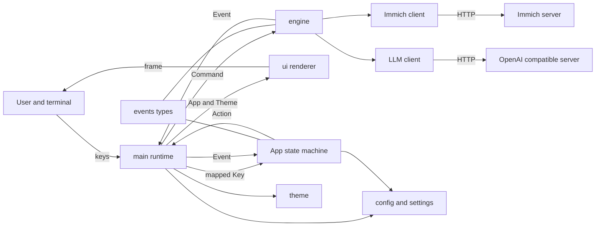
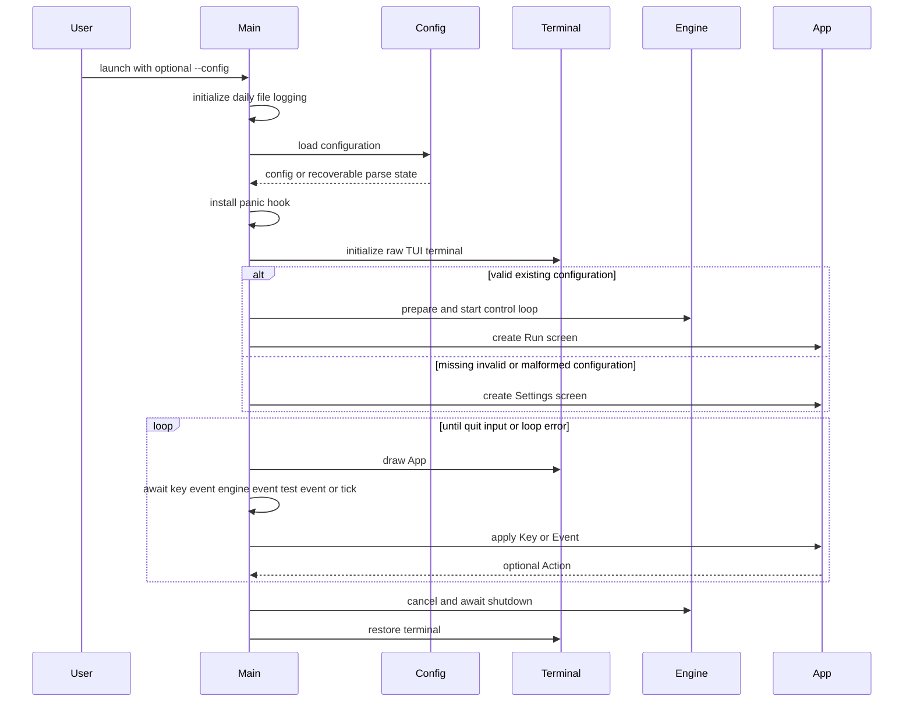
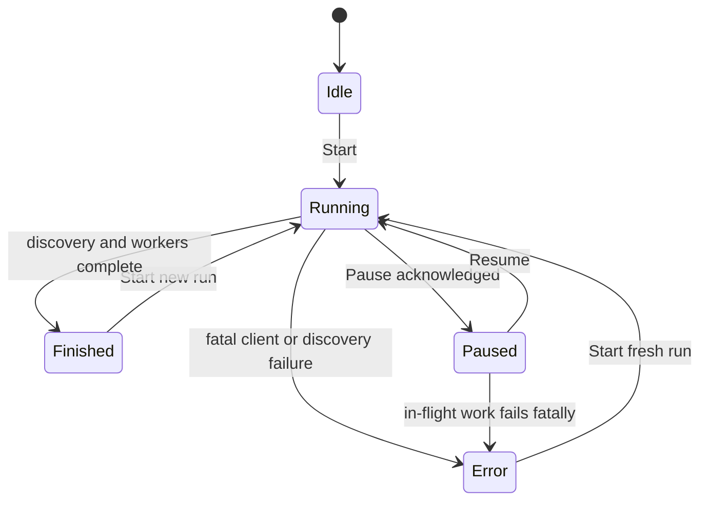
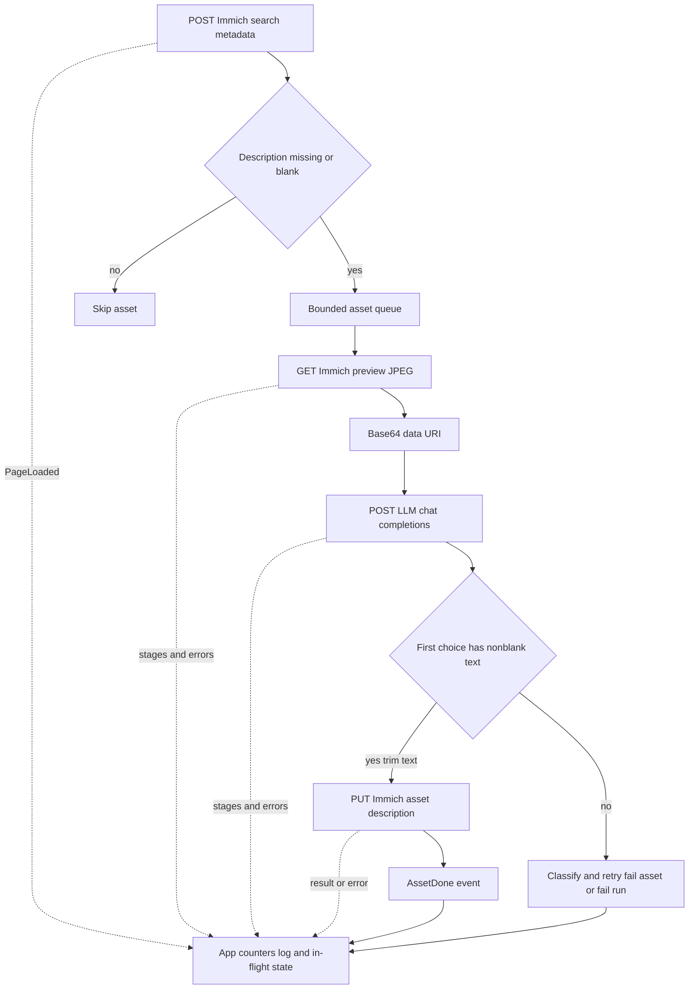

# Architecture

This document describes the implementation at the current `main` revision. It is a maintainer's map of the code that exists, including its concurrency and failure semantics; it is not a proposal for a future system.

## Overview

`immich-alt-text` is a foreground Rust terminal application. For each Immich image whose EXIF description is absent or blank, it downloads Immich's preview rendition, asks an OpenAI-compatible vision model for a short description, and writes that text back to the asset. Immich is the durable work ledger: a later run searches again and skips assets that already have nonblank descriptions. The application itself has no database, queue service, daemon, or background process.

The implementation separates four kinds of work:

- [`main`](src/main.rs#L35-L54) owns process concerns and side effects: CLI parsing, logging, terminal setup/restoration, keyboard input, the async event loop, connection-test tasks, runtime replacement, and shutdown.
- [`App`](src/app.rs#L51-L75) is the in-memory UI state machine. `App::on_key` turns input into an [`Action`](src/events.rs#L100-L110), while `App::on_event` folds engine and connection-test events into renderable state. It performs no filesystem, terminal, network, or async I/O.
- [`engine`](src/engine.rs#L42-L152) is the processing module. Its small external interface is `prepare`/`spawn`, `EngineHandle::send`, and the event receiver supplied by the caller; behind that interface it owns run control, discovery, worker coordination, retries, pause, cancellation, and terminal-event delivery.
- [`ui`](src/ui/mod.rs#L14-L19) is a read-only projection of `App` and `Theme` onto a Ratatui frame. The run renderer never mutates application state; the settings renderer only updates a view-only prompt-width cache so keyboard navigation follows the current terminal width.

The HTTP-specific implementations are kept in [`immich`](src/immich.rs#L46-L173) and [`llm`](src/llm.rs#L22-L133). Configuration serialization and validation live in [`config`](src/config.rs), editable settings-form state in [`settings`](src/settings.rs), and style selection in [`theme`](src/theme.rs).

### Design goals

- **Safe incremental operation.** Only assets blank at discovery time enter the queue. Each successful write is immediately durable in Immich, so quitting and rerunning naturally resumes by searching again.
- **A responsive, observable foreground run.** Discovery and processing overlap, multiple assets may be processed concurrently, and bounded channels limit memory. Events expose page totals, per-asset stages, results, failures, and run completion to the TUI.
- **Explicit failure scope.** Client errors are classified as transient, per-asset permanent, or run-fatal. Transient operations retry with bounded exponential backoff; an asset-local failure does not discard the rest of the queue.
- **Predictable lifecycle behavior.** Commands are acknowledged, pause has a defined handoff point, cancelled runs stop producing new run events, and runtime replacement cannot overlap an old in-flight Immich write.
- **Testability at real seams.** Pure state transitions, channel interfaces, HTTP endpoints, rendering backends, replacement preparation, and retry timing can be exercised without a real terminal, Immich installation, or LLM.
- **Keep credentials out of routine output.** The TUI masks keys by default, request logging omits headers and bodies, malformed configuration is reported generically, and Unix persistence uses mode `0600`.

### Non-goals and limits

This is not a library-wide asset synchronization system, a durable local job runner, or a server. It does not watch for new photos, run on a schedule, persist run telemetry, edit tags, generate releases, provide a background service, or maintain its own resume cursor. It uses chat completions only, does not stream model output, and does not validate the generated prose beyond requiring nonblank text. It also does not provide transactional compare-and-set updates in Immich: an asset that was blank when discovered is later updated with a normal `PUT`, so an external edit made between discovery and write can be overwritten.

## System context and module boundaries



[`events.rs`](src/events.rs) is the vocabulary shared across the main runtime, state machine, and engine. `Key` removes Crossterm types from `App`; `Action` describes side effects for `main`; `Command` is the engine control interface; and `Event` is the complete stream needed to update the UI. This keeps terminal and async details out of the state machine and keeps Ratatui details out of the engine.

The boundary is deliberately not a trait hierarchy. `Engine` contains concrete `ImmichClient` and `LlmClient` values, and both contain concrete `reqwest::Client`s. Variation for tests occurs through configured HTTP base URLs and Wiremock servers. This is a compact interface with less indirection, at the cost of making non-HTTP client substitution harder.

### `App` as the state owner

[`App::new`](src/app.rs#L77-L106) initializes screen, run telemetry, newest-first log, settings form, footer state, and a generation number for connection tests. The first-run flag chooses `Settings`; otherwise the initial screen is `Run`. [`App::on_key`](src/app.rs#L183-L192) and [`App::on_event`](src/app.rs#L108-L181) are the normal state-machine paths, supplemented by the explicit config-save callbacks. `main` has two exceptional direct mutations during setup/runtime coordination: it sets `app.settings.message` during startup/runtime setup and sets `app.run_state` plus `app.footer_message` when a command is requested without an active engine.

Run state is one of `Idle`, `Running`, `Paused`, `Finished`, or `Error(String)`. Engine events update cumulative discovery counts, the in-flight list, completion/failure counters, timing aggregates, and a log capped at 500 rows. A rolling window of at most 20 completion instants drives the displayed completion rate and ETA. Starting another run clears counters and timing but intentionally retains the log; successfully applying new settings resets telemetry to idle and also retains the log.

The state transition to `Running` or `Paused` happens immediately when the key is accepted, before the corresponding command acknowledgment returns. This makes the UI feel immediate, while the engine's acknowledgment protocol supplies the stronger concurrency guarantees described below.

## Process startup and terminal lifecycle



[`main`](src/main.rs#L35-L54) parses one optional `--config` path, initializes nonblocking daily file logging under the XDG state directory, and loads the selected file. A missing file becomes `Config::default()` and enters setup because required fields do not validate. A syntactically valid file is also checked with `Config::validate`; invalid values enter setup with the loaded values available for correction. A TOML parse failure is recoverable but uses fresh defaults and a generic message so malformed file contents, which may include secrets, are not copied into the TUI. Other read errors terminate startup.

The panic hook installed by [`install_panic_hook`](src/main.rs#L101-L108) restores the terminal before delegating to Rust's default panic hook. On the nonpanic path, `ratatui::restore()` runs after `run` returns, including when drawing or another loop operation returns an error. The panic hook is terminal hygiene, not graceful engine shutdown; ordinary loop exit uses the explicit shutdown path.

When setup is required, no engine is created. Otherwise [`spawn_runtime`](src/main.rs#L180-L188) creates a bounded event channel of 1,024 messages, validates and constructs the engine, and starts its control loop. Construction does not start an asset run; the engine remains idle until `Command::Start`.

### Keyboard and event loop

[`spawn_key_reader`](src/main.rs#L110-L135) runs Crossterm's blocking `poll`/`read` operations on a plain OS thread. It polls every 100 ms, accepts key-press events only, maps supported keys into the application-level `Key` enum, and forwards them through an unbounded channel. The short poll lets the thread notice a closed receiver and exit. Terminal resize and other Crossterm events are ignored.

[`run`](src/main.rs#L208-L284) draws once at the top of every loop iteration, then `tokio::select!` waits for one of four sources:

1. a mapped key;
2. an event from the currently active engine runtime;
3. a settings connection-test result; or
4. a 250 ms interval tick.

Keys and events cause a redraw on the next iteration. Ticks also redraw even when state has not changed, which advances elapsed durations, in-flight timers, rate/ETA presentation, and adapts the frame to a resized terminal. If the key channel closes, or `q`/`ctrl-c` requests quit, the loop ends. A closed or absent engine event receiver is converted to a pending future rather than causing a busy loop.

Connection tests are separate from the engine. `ctrl-t` validates the candidate form, aborts any previous test task, then [`test_connections`](src/main.rs#L343-L377) checks Immich's version endpoint and the LLM's models endpoint concurrently. Each side has an outer 10-second cap in addition to its configured HTTP timeout. A monotonically wrapping test ID makes late results harmless: `App` accepts only the current generation.

Before returning, the loop aborts a connection-test task and calls [`EngineHandle::shutdown`](src/engine.rs#L64-L71). Shutdown first cancels cooperatively and waits up to five seconds. If the control task is still alive, a separate force token causes worker tasks to be aborted, after which shutdown waits conclusively for the engine task. This cleanup also runs when the loop itself returns an error.

## Run lifecycle and concurrency



`RunState` has no `Stopping` variant. The diagram therefore shows only the application's actual run states; process shutdown and engine cancellation are a separate lifecycle that can begin from any state when the user quits or runtime replacement starts.

`PreparedEngine` is validated and owns no tasks. Calling [`PreparedEngine::start`](src/engine.rs#L80-L98) creates a bounded 16-message control channel and spawns `control_loop`. Every [`EngineHandle::send`](src/engine.rs#L50-L62) includes a one-shot acknowledgment and waits for it; command receipt therefore has observable completion rather than fire-and-forget timing.

Each accepted `Start` creates a [`Run`](src/engine.rs#L166-L174) with a child cancellation token, a separate cancellation token for terminal events, a fresh `watch<bool>` pause channel initially set to `false`, an `active` atomic, and a run task. A `Start` while an ordinary active run is still healthy is ignored but acknowledged. A completed or cancelled run is replaceable. If a cancelled run is still active—most importantly because an Immich `PUT` is in flight—the control loop waits for that task before starting its successor. If the previous run has already marked itself inactive but is blocked sending `RunFinished`, it is retired without blocking the new start; its terminal-event token is cancelled so the stale send can disappear.

[`Engine::run`](src/engine.rs#L321-L387) creates an asset channel sized to `workers * 4`, shares its receiver behind a short-held async mutex, and starts exactly `run.workers` worker tasks. Discovery runs concurrently with those workers. The queue bounds prefetched `Asset` values and backpressures discovery when consumers lag. Workers serialize only the act of receiving from the single receiver; preview, LLM, and write operations run independently after dequeue.

[`discover`](src/engine.rs#L389-L452) requests newest-first image pages, adds every returned item to `scanned`, filters with `Asset::needs_description`, adds wanted assets to `queued`, emits cumulative `PageLoaded`, and sends wanted assets to the worker queue. It follows `nextPage` only when the parsed value is greater than the current page. Dropping the sender after discovery tells workers that no more assets remain. `DiscoveryDone` reports the final queue size. Once discovery and all workers finish, `active` is cleared *before* attempting `RunFinished`; this ordering keeps restart live even under event-channel backpressure.

An asset's observable order is:

`AssetStarted` → `Fetching` → preview GET → `CallingLlm` → completion POST → `Writing` → description PUT → `AssetDone`.

Failures replace `AssetDone` with `AssetFailed`, unless the error is fatal or cancellation wins. Success and failure atomics supply the final `RunFinished` totals.

### Backpressure, pause, and cancellation

The main engine-event channel is bounded at 1,024 in production. All normal event sends await capacity and race cancellation with biased priority toward cancellation. This prevents an old run from hanging forever or publishing newly blocked nonterminal events after it has been cancelled. The channel is part of flow control: a stalled UI eventually slows workers and discovery rather than allowing telemetry to grow without bound.

Pause is intentionally **admission control**, not suspension of HTTP calls already in progress. Workers check the pause watch before dequeue/admission. To close the race between dequeue and `AssetStarted`, a worker first reserves event capacity, then enters a shared `handoff` mutex, rechecks cancellation and pause, and publishes `AssetStarted` while holding that mutex. `Command::Pause` sets the watch value and acquires/releases the same mutex before acknowledging. Consequently, after the pause acknowledgment, no new asset can cross the started boundary—even with multiple workers or a saturated event channel. An asset already started may finish and emit stages/results while the UI says paused. `Resume` clears the watch flag; a fresh run never inherits an earlier run's paused state.

Run cancellation interrupts discovery, queue sends, pause waits, retry sleeps, preview requests, and LLM requests. Immich description writes use `cancel_in_flight = false`: once issued, a `PUT` is awaited rather than dropped. After it returns, cancellation prevents another retry or success event. This favors a known write outcome and prevents old/new runtime writes for the same asset from overlapping, but it can delay restart, replacement, or graceful shutdown until the HTTP request returns. Configured request timeouts bound normal HTTP waits; process shutdown adds the five-second force-abort escape hatch. Config replacement deliberately has no force timeout and waits for the write to return.

Fatal delivery uses a separate `terminal_cancel` token because the run token is cancelled before `Event::Fatal` is sent. Starting a successor cancels that terminal token, ensuring an old blocked fatal event cannot leak into the new run.

### Retry and error scope

[`retry`](src/engine.rs#L604-L657) makes `run.retries + 1` total attempts. Only `Transient` errors retry, with production delays of 2, 4, 8 seconds and so on (saturating arithmetic). `Permanent` and `Fatal` return immediately. Exhausted transient errors include the total try count in their message.

During per-asset processing, transient exhaustion and permanent errors emit `AssetFailed` and the worker continues. Fatal errors cancel the entire run and emit `Fatal`. Discovery cannot sensibly continue without a valid page stream, so any final discovery error—fatal, permanent, or exhausted transient—stops the run.

## External request flows



### Immich

[`ImmichClient`](src/immich.rs#L46-L173) strips a trailing slash, appends `/api`, and sends `x-api-key` on every request. It implements four operations:

- `version`: `GET /api/server/version`, returning `vMAJOR.MINOR.PATCH` for connection testing;
- `list_images`: `POST /api/search/metadata` with `type: IMAGE`, `withExif: true`, newest-first order, page, and size;
- `preview_jpeg`: `GET /api/assets/{id}/thumbnail?size=preview`, rejecting an empty body; and
- `set_description`: `PUT /api/assets/{id}` with `{ "description": text }`.

Missing EXIF data, `null` descriptions, and whitespace-only descriptions all need work. Search response decoding and malformed `nextPage` values are permanent errors. The client calls the response bytes a JPEG because it requests the preview rendition and the LLM data URI declares `image/jpeg`; it does not inspect or transcode the bytes.

Immich 401 and 403 responses are fatal and advise checking the key. HTTP 429, all 5xx responses, transport failures, and timeouts are transient. Other non-success statuses are permanent. Request-construction and body-shape errors are permanent except client-construction failures, which are fatal.

### LLM

[`LlmClient`](src/llm.rs#L22-L133) treats the configured base URL as the OpenAI-compatible API root. `ping` sends `GET {base}/models`. `describe` base64-encodes the preview into a `data:image/jpeg;base64,...` URL and sends one user message to `POST {base}/chat/completions`; the message content contains the configured prompt followed by an `image_url` part. The request includes the configured model and `max_tokens`.

The response parser uses only the first choice's optional string `message.content`, trims surrounding whitespace, and rejects missing or blank output as permanent. There is no prompt postprocessing, output length check beyond the provider's token limit, content moderation layer, or fallback model. The default prompt asks for one or two plain descriptive sentences without preamble, quotes, or “This image shows”; `llm.prompt` is editable in the settings form and is passed verbatim.

LLM 401 and 403 are fatal key failures. A 404 is also fatal because it usually indicates the base URL or model path is wrong. HTTP 429 and 5xx, transport failures, and timeouts are transient; other statuses and malformed/empty completion bodies are permanent.

### API keys and logging

The Immich key is required by validation. The LLM key is optional; when empty, `LlmClient::authorize` omits the `Authorization` header, supporting local unauthenticated servers. When present, it uses `Authorization: Bearer ...`. Keys remain in process memory and are persisted as plaintext TOML; there is no keychain integration or encryption.

The settings form marks both key fields secret and renders one bullet per character until `ctrl-r` reveals them. HTTP debug logs contain method, URL path, status, and elapsed milliseconds, but not query bodies, headers, full URLs, prompts, images, descriptions, or keys. Unix config writes use owner-only permissions as a compensating control.

## Configuration, settings, and replacement

All config structs use Serde defaults, so omitted sections or keys receive these values:

| Setting | Default | Validation / behavior |
| --- | --- | --- |
| `immich.url` | empty | parseable `http` or `https` URL |
| `immich.api_key` | empty | nonblank after trimming |
| `immich.timeout_secs` | `30` | no additional range check |
| `llm.base_url` | `http://localhost:1234/v1` | parseable `http` or `https` URL |
| `llm.api_key` | empty | optional |
| `llm.model` | empty | nonblank after trimming |
| `llm.max_tokens` | `200` | at least 1 |
| `llm.timeout_secs` | `120` | no additional range check |
| `llm.prompt` | built-in alt-text prompt | no nonblank check; editable in settings |
| `run.workers` | `1` | 1 through 64 |
| `run.retries` | `3` | 0 through 10 |
| `run.page_size` | `1000` | 1 through 1000; file-only |
| `ui.theme` | `btop` | enum value `btop` or `mono`; editable with a selector |

`page_size` is the only file-only setting. The settings form also edits the prompt, both timeouts in seconds, retry count, and theme, alongside Immich URL/key, LLM URL/key/model, workers, and max tokens. [`SettingsForm::to_config`](src/settings.rs#L97-L117) clones the committed config, overlays trimmed form values, parses numeric fields, and validates the result. `ctrl-u` clears the focused text field, which makes replacing the long default prompt practical; the theme row uses left/right arrows or `h`/`l` and never accepts text input.

[`config::save`](src/config.rs#L173-L215) validates before serialization, pretty-prints TOML, creates parent directories, and stages a uniquely named temporary file in the destination directory. The file is created exclusively and, on Unix, opened and explicitly set to mode `0600`. The implementation writes, flushes, calls `sync_all`, closes, and renames the temporary file over the destination. A guard removes an unpersisted temporary file on error. Same-directory rename gives atomic file replacement on supported filesystems and replaces a previously permissive file with an owner-only one. It does not fsync the parent directory, and non-Unix platforms do not receive a Unix permission guarantee.

Saving through the TUI is a small transaction coordinated by [`apply_saved_config_with`](src/main.rs#L299-L331):

1. prepare and validate an inert replacement engine;
2. persist the candidate config;
3. take the old runtime and wait for `shutdown_for_replacement`;
4. start the replacement, switch theme, and commit the candidate into `App`.

If preparation or persistence fails, the old config, engine, theme, run state, telemetry, and edited candidate remain intact. Saving while `Running` is refused; the user must pause first. A successful save from paused state terminates the old run, resets run telemetry to idle, keeps the log, and returns to the run screen. Replacing the entire `EngineRuntime` also drops its old event receiver, so already-queued old events cannot mutate the reset `App`.

## TUI layout and interaction

[`ui::render`](src/ui/mod.rs#L14-L19) dispatches solely on `App.screen`. Width-aware truncation counts terminal cells rather than Unicode scalar values. The run screen has three layout modes:

- When the inner height is 8 rows or less (normally a terminal height of 10 or less), [`render_tiny`](src/ui/run.rs#L365-L385) shows only the outer header, progress bar/count, and footer.
- At widths below 80 columns, progress and counters stack vertically. At 80 or more they sit side by side; widths below 100 use a 50/50 split and wider screens use 55/45.
- The in-flight panel appears only at terminal heights of at least 24. Its height is `workers + 2`, allowing one row per configured worker. The remaining space belongs to the newest-first result log.

A representative wide run screen (illustrative and abridged, not a literal snapshot rendering) is:

```text
╭ immich-alt-text ─ photos.home.lan ─ model @ localhost:1234 ─ RUNNING ╮
│╭ progress ───────────────────╮╭ counters ───────────────────────────╮│
││████████░░░░ 1 287 / 3 102  ││scanned 14 920   done        1 284  ││
││elapsed 01:42:17  rate 12.6/min│queued 3 102    failed          3  ││
│╰─────────────────────────────╯╰─────────────────────────────────────╯│
│╭ in flight ─────────────────────────────────────────────────────────╮│
││● IMG_4471.HEIC   calling llm…   3.2 s                              ││
│╰────────────────────────────────────────────────────────────────────╯│
│╭ log ───────────────────────────────────────────────────────────────╮│
││18:42:11  ✓ IMG_4470.HEIC  4.3 s  A dog sits on a dock at sunset.   ││
││18:42:02  ✗ IMG_4468.HEIC         llm: timeout ... (4 tries)        ││
│╰────────────────────────────────────────────────────────────────────╯│
│ s start  p pause  ↑↓ scroll log  enter expand  c settings  q quit   │
╰──────────────────────────────────────────────────────────────────────╯
```

The settings screen is a centered form, up to 78 columns wide. Focus is marked with `▸` and `▏`; test results and validation/save messages appear below the fields. On short terminals the content area scrolls to keep the focused row visible while the footer remains fixed. Text fields accept normal typing, backspace, and `ctrl-u`; the theme row is a compact two-option selector.

```text
╭ settings ────────────────────────────────────────────────────────────╮
│  immich url         https://photos.example                            │
│  immich api key     ••••••••                         ctrl-r show     │
│▸ prompt             Describe the subject and setting of this photo.   │
│                     Mention important colors, objects, and actions.  │
│                     Avoid speculation and do not add a preamble.▏    │
│  llm timeout (s)    120                                              │
│  theme              (●) btop   ( ) mono                              │
│  ctrl-t test connections   immich ✓ v3.1.0   llm ✓ 200 OK             │
│ ctrl-s save    ctrl-t test    ← → theme    ctrl-u clear    esc back  │
╰──────────────────────────────────────────────────────────────────────╯
```

Run-screen controls are `s` to start from idle/finished/error, `p` to pause or resume, arrows to move the log selection, `enter` to open the selected row's full description/error popup, `c` to open settings, and `q` to quit. `esc` or `enter` closes the popup; other run keys are ignored while it is open, except global `ctrl-c`.

Settings controls are `tab`/`shift-tab` to wrap focus, `enter` to advance (or save on the last field), normal characters and backspace to edit, and `ctrl-u` to clear a text field. While the prompt is focused, arrows move its cursor and `enter` inserts a line break. `ctrl-r` reveals/masks both keys, `ctrl-t` tests, `ctrl-s` saves, and `esc` returns without committing edits. `ctrl-c` quits from either screen. Settings may be viewed and tested during a run, but saving requires the run to be paused.

[`Theme`](src/theme.rs#L7-L98) centralizes semantic styles rather than scattering colors through renderers. `btop` uses reverse video for selection; indexed colors apply to the semantic styles for success, error, warning, information, accent, names, durations, dim text, and borders. It also renders a green-to-yellow-to-red progress gradient. `mono` removes colors while retaining bold titles/accents, dim secondary text, and reversed selection. Run-state labels use success for running, warning for paused, error for error, and information for idle/finished.

## Important invariants and tradeoffs

- **`App` normally changes through explicit state-machine entry points.** `App::on_key` and `App::on_event` are the normal paths; renderers are pure and engine tasks never share `App`. The two `main` exceptions are the direct setup/runtime assignment to `app.settings.message` and the no-engine command fallback, which assigns `app.run_state` and `app.footer_message`.
- **An `AssetStarted` event is the pause handoff boundary.** Once pause is acknowledged, no additional asset starts, although admitted work can complete.
- **At most `workers` assets are actively processing.** The `workers * 4` queue may hold additional discovered assets, but it does not represent active HTTP pipelines.
- **Per-asset stages are ordered.** Across assets, events may interleave freely. Counters are cumulative and use saturating/atomic updates where concurrency matters.
- **Normal events are backpressured and cancellation-aware.** This bounds memory and suppresses stale post-cancellation sends, but UI stalls can slow actual processing.
- **Immich writes are protected from cooperative mid-request cancellation.** This prevents ambiguous overlapping replacement writes, at the cost of potentially slower pause-independent restart/replacement/shutdown.
- **Fatal is terminal for one run, not for the process.** `App` enters `Error`, and `s` can create a fresh run with fresh pause/cancellation state.
- **Config application is commit-late in memory.** The UI adopts a candidate only after engine preparation and persistence succeed. Runtime replacement then waits conclusively for the old engine, favoring write safety over instant reconfiguration.
- **Immich is the resume mechanism.** This is simple and durable, but every run rescans pages and there is no snapshot isolation between search and update.
- **The clients expose only the protocol subset needed by this app.** This keeps them small, but provider-specific deviations from Immich or OpenAI-compatible shapes require code changes.
- **Credential protection is pragmatic, not absolute.** Masking, narrow logs, and Unix `0600` reduce accidental disclosure; keys are still plaintext on disk and strings in memory.
- **Wall-clock presentation is partly injectable.** Rendering and rate/ETA helpers accept `Instant`, while event timestamps and completion instants are captured internally. Tests can make screens deterministic by constructing `App`, but there is no general clock interface.

## Testing architecture

The tests follow the module seams rather than relying on end-to-end terminal automation.

**Inline unit tests.** [`app.rs` tests](src/app.rs#L463-L883) exercise event folding, counters, timing, state transitions, keyboard behavior, log capping/selection, save commit/failure behavior, and stale connection-test suppression. [`config.rs` tests](src/config.rs#L353-L594) cover defaults, validation, TOML round trips, failure-safe save checkpoints, same-directory staging, temporary-file cleanup, and Unix permissions. [`settings.rs` tests](src/settings.rs#L120-L202), [`theme.rs` tests](src/theme.rs#L100-L173), and [`ui/mod.rs` tests](src/ui/mod.rs#L72-L96) verify form conversion/masking, semantic styles, formatting, and cell-aware truncation. Binary-local [`main.rs` tests](src/main.rs#L380-L658) cover terminal-key mapping, malformed-config recovery, config replacement rollback, event-receiver replacement, and shutdown on loop error.

**Wiremock client tests.** The tests beside [`ImmichClient`](src/immich.rs#L226-L495) and [`LlmClient`](src/llm.rs#L176-L410) start local Wiremock servers and assert exact methods, paths, query parameters, JSON bodies, and authentication headers. They also pin response parsing and the transient/permanent/fatal status matrix, including timeouts and malformed bodies. These are protocol tests without external network dependencies.

**Engine integration tests.** [`tests/engine_test.rs`](tests/engine_test.rs) composes two Wiremock servers with real clients, the real engine, and bounded Tokio channels. Straight-line tests verify blank-description filtering, writes, stage order, pagination, retries, and continuation after asset failure. Concurrency regressions use delayed and gated responders to verify multiworker pause handoff, immediate pause, saturated event channels, cancellation without late events, fatal cancellation during another worker's write, restart after fatal/finish, conclusive shutdown, and nonoverlapping restart/replacement writes. `EngineOptions::backoff_base` is the intentional timing seam that keeps retry tests fast.

**Snapshot tests.** [`tests/ui_snapshots.rs`](tests/ui_snapshots.rs) builds deterministic `App` values, supplies a fixed `Instant`, renders through Ratatui's `TestBackend`, and uses Insta snapshots. The checked sizes cover wide (`120x40`), boundary side-by-side (`80x24`), tiny (`40x10`), idle/error/popup states, and settings with results/errors. A direct `79x23` assertion covers the stacked/no-in-flight breakpoint without another snapshot. Snapshot artifacts live under [`tests/snapshots`](tests/snapshots/).

**Manual fake environment.** [`examples/fake_servers.rs`](examples/fake_servers.rs) runs local Immich and LLM Wiremock servers, creates 40 representative assets, delays completions so in-flight state is visible, injects several write failures, and writes `target/demo-config.toml`. It is a manual TUI demonstration and smoke-test fixture, not a production server.

The strongest seams are the `Command`/`Event` channels, pure `App` transitions, HTTP URLs, Ratatui backend, candidate-runtime preparation closure, and retry options. There is deliberately no mock-client trait or fully abstract clock. Maintainers changing concurrency should favor the gated engine tests; changing HTTP shape should start with client Wiremock tests; changing layout or semantic presentation should update assertions and snapshots only after inspecting the rendered diff.
