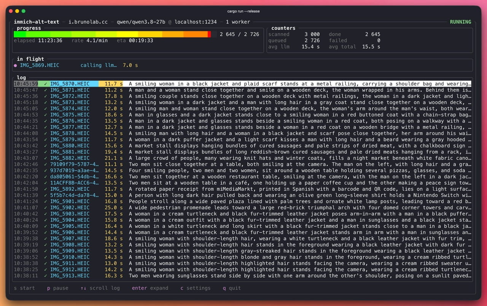

# immich-alt-text

`immich-alt-text` is a terminal application for Immich. It uses a vision model to create descriptions for images that do not have descriptions.



The application uses Rust and [Ratatui](https://ratatui.rs). It is a personal and experimental project. For the internal design, see [ARCHITECTURE.md](ARCHITECTURE.md).

## What it does

For each image without a description, the application:

1. Finds the image in Immich.
2. Downloads the preview JPEG.
3. Sends the image to an OpenAI-compatible vision model.
4. Writes the returned description to Immich.

The application does not change images that already have descriptions. Immich stores the progress. You can stop a run and start it again later.

### Dry-run mode

Dry-run mode performs the same search, download, and model requests. It does not update image descriptions in Immich.

You can enable dry-run mode in either way:

- Start the application with `--dry-run`.
- Set `dry_run = true` in the settings screen.

The CLI flag applies only to the current run. It overrides the saved setting. The settings value is saved for future runs.

## Requirements

- Rust 1.98 or newer when you build from source. The repository defines the development toolchain in `rust-toolchain.toml`.
- An Immich server and an API key.
- A vision model that supports an OpenAI-compatible API.

For normal mode, use an Immich API key with these permissions:

- `asset.read` to list images and read descriptions.
- `asset.view` to download image previews.
- `asset.update` to write descriptions.

Dry-run mode does not need `asset.update`.

The server-version check does not need another permission. Older Immich versions may not support these permissions. On those versions, use a full access API key.

The application was tested with LM Studio at `http://localhost:1234/v1`. Ollama, llama.cpp server, vLLM, OpenRouter, and OpenAI can use the same setting.

## Install a pre-built binary

The installer downloads the latest release for your platform. It checks the SHA-256 checksum. It installs `immich-alt-text` in `~/.local/bin` by default.

| Platform | Architecture | Release target |
| --- | --- | --- |
| Linux | x86_64 / AMD64 | `x86_64-unknown-linux-musl` |
| Linux | ARM64 | `aarch64-unknown-linux-musl` |
| macOS | Apple Silicon | `aarch64-apple-darwin` |

For a quick install:

```bash
curl -fsSL https://raw.githubusercontent.com/brunojppb/immich-alt-text/main/install.sh | sh
```

For a safer install, download the script first. Read it before you run it:

```bash
curl -fsSLO https://raw.githubusercontent.com/brunojppb/immich-alt-text/main/install.sh
less install.sh
sh install.sh
```

To use another directory, set `INSTALL_DIR`:

```bash
INSTALL_DIR="$HOME/bin" sh install.sh
```

The installer creates the directory when needed. It never runs `sudo`. It prints a PATH message when the directory is not on your PATH.

### Build from source

```bash
cargo install --path .
```

Building from source requires Rust 1.98 or newer.

## Run

```bash
immich-alt-text
```

To run without changing Immich descriptions:

```bash
immich-alt-text --dry-run
```

The first launch opens the settings screen. Enter these values:

- Immich URL
- Immich API key
- LLM base URL
- Model name

Press `ctrl-t` to test both connections. Press `ctrl-s` to save the settings. The application saves them to `~/.config/immich-alt-text/config.toml` and opens the run screen. Press `s` to start a run.

You can pass another config file:

```bash
immich-alt-text --config target/demo-config.toml
```

## Keys

| Screen | Key | Action |
| --- | --- | --- |
| run | `s` | start a run |
| run | `p` | pause or resume |
| run | `↑` `↓` | move through the log |
| run | `enter` | show the full text for the selected row |
| run | `c` | open settings |
| run | `q` or `ctrl-c` | quit |
| settings | `tab` `shift-tab` | move between fields |
| settings | `ctrl-r` | show or hide API keys |
| settings | `ctrl-t` | test both connections |
| settings | `ctrl-s` | save and return to the run screen |
| settings | `←` `→` or `h` `l` | select the theme or dry-run value |
| settings | `←` `→` `↑` `↓` | move in the prompt |
| settings | `enter` | add a line break in the prompt |
| settings | `ctrl-u` | clear the focused text field |
| settings | `esc` | discard changes and return |

## Config file

```toml
[immich]
url = "https://photos.home.lan"
api_key = "..."
timeout_secs = 30

[llm]
base_url = "http://localhost:1234/v1"
api_key = ""            # optional
model = "gemma-3-12b-it"
max_tokens = 200
timeout_secs = 120
prompt = """
Write alt text for this photo: one or two plain sentences describing what is
visible. No preamble, no quotes, no "This image shows".
"""

[run]
workers = 1             # parallel LLM calls, 1-64
retries = 3             # 0-10 retries; default backoff is 2 s, 4 s, 8 s
page_size = 1000        # 1-1000
dry_run = false         # do not update Immich when true

[ui]
theme = "btop"          # or "mono"
```

`page_size` is file-only. The settings screen also lets you change the prompt, Immich and LLM timeouts, retry count, dry-run mode, and UI theme.

The prompt editor supports multiple lines. Use the arrow keys to move in the prompt. Press `enter` to add a line break. Press `ctrl-u` to replace the prompt.

## Logs

The application writes daily UTC logs to `~/.local/state/immich-alt-text/debug.log.YYYY-MM-DD`.

Set `RUST_LOG=debug` for more detail. The logs never contain request bodies or API keys.

## Try it without a real library

Start the fake servers in one terminal:

```bash
cargo run --example fake_servers
```

Start the application in a second terminal:

```bash
cargo run -- --config target/demo-config.toml
```

## Development

Run the tests and the linter:

```bash
cargo test
cargo clippy --all-targets -- -D warnings
```

### Releases

Releases are published only when a maintainer starts the release workflow from `main` with a version.

Pull requests, pushes, and tag creation do not publish a release. The workflow updates the Cargo package version, creates the `v<version>` tag, builds the three supported archives, and publishes them to GitHub Releases. It also publishes matching `.sha256` files and release notes.
